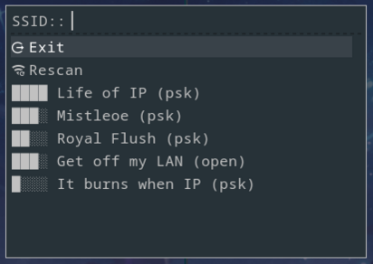
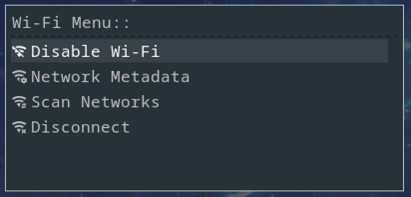
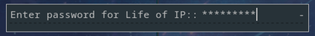
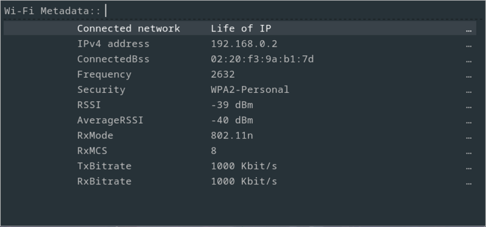

# Minimalist Wi-Fi Menu with Rofi and IWD

This is a minimalist Wi-Fi menu built with **Rofi** as the frontend and **IWD** (iNet Wireless Daemon) as the backend for managing Wi-Fi connections.

## Features

- **Enable or Disable Wi-Fi**  
  Easily turn the Wi-Fi interface on or off.

- **View Network Metadata**  
  Instantly access detailed network information, including IP address, security type, and connection bitrate.

- **Scan for Available Networks**  
  Displays all available networks for easy selection.

- **Connect or Disconnect**  
  Connect or disconnect from the current Wi-Fi network.

- **Copy Network Details**  
  Uses **xclip** to copy Wi-Fi metadata (e.g., SSID, signal strength) to the clipboard for convenience.

## Screenshots

<table style="width: 100%; table-layout: fixed;">
  <tr>
    <td align="center" style="width: 50%;">
      
      
<strong>Main Menu</strong>

    </td>
    <td align="center" style="width: 50%;">
      
      
<strong>Scan Menu</strong>

    </td>
  </tr>
  <tr>
    <td align="center" colspan="2" style="width: 100%;">
      
      
<strong>Password Prompt Box</strong>

    </td>
  </tr>
  <tr>
    <td align="center" colspan="2" style="width: 100%;">
      
      
<strong>Network Metadata</strong>

    </td>
  </tr>
</table>

## Dependencies

- **IWD**  

- **Rofi**  

- **xclip** (Optional)

- **Nerd Fonts** (Optional)

## Configuration

Configuration is minimal and primarily manual. You may need to adjust scripts or dependencies to suit your setup.

## TO-DO

- **Forget Wi-Fi Option**  
  Add an option to forget a saved Wi-Fi network.  

- **Window Management Variables**  
  Introduce variables to allow users to adjust or move the window position.  

- **Custom Rofi Theme**  
  Create a separate Rofi theme for improved integration and aesthetics.  

## Known Issues

- **SSID Formatting**  
  Can not connect to Wi-Fi networks, with SSIDs containing more than two consecutive spaces or trailing spaces, due to the way formatting is performed.

- **Unsafe Network Handling**  
  After connecting to a known unsafe network, attempting to connect to another known safe network may still prompt for a password. Although not providing the password won’t cause an issue and it will eventually connect to that safe network.

### **Note**

- Known Networks: Previously connected to and whose configuration is stored
- Known Safe Networks: Security remains unchanged
- Known Unsafe Networks: Security has been changed, requires passphrase
